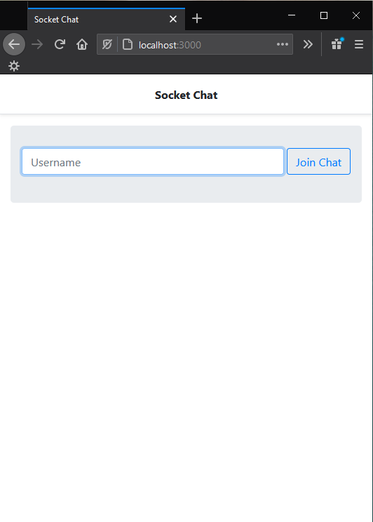
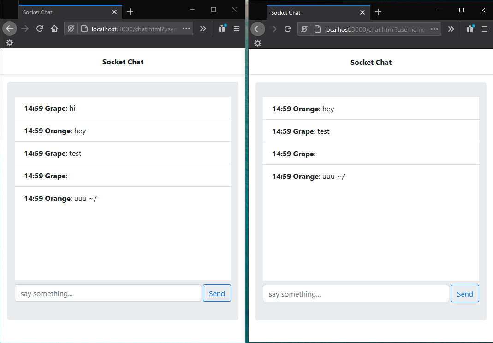

# Chat application com Node e Socket io

Uma aplicação simples de chat feita com um servidor [node](https://nodejs.org/en/) e a biblioteca [socket.io](https://socket.io/) para a comunicação com o servidor em tempo real.

## Arquivos e pastas

- [package.json](./package.json) : Arquivo sobre o projeto feito através do gerenciador de pacotes npm.
- [server.js](./server.js) : Arquivo do servidor node.
- [publick](./public) : Pasta contendo arquivos da parte front end.
    - [index.html](./public/index.html) : Página inicial, onde é inserido o username.
    - [chat.html](./public/chat.html) : Página da aplicação de chat.
        - [chat.js](./public/js/chat.js): Javascript da aplicação de chat.

## Imagens de exemplo da Aplicação

